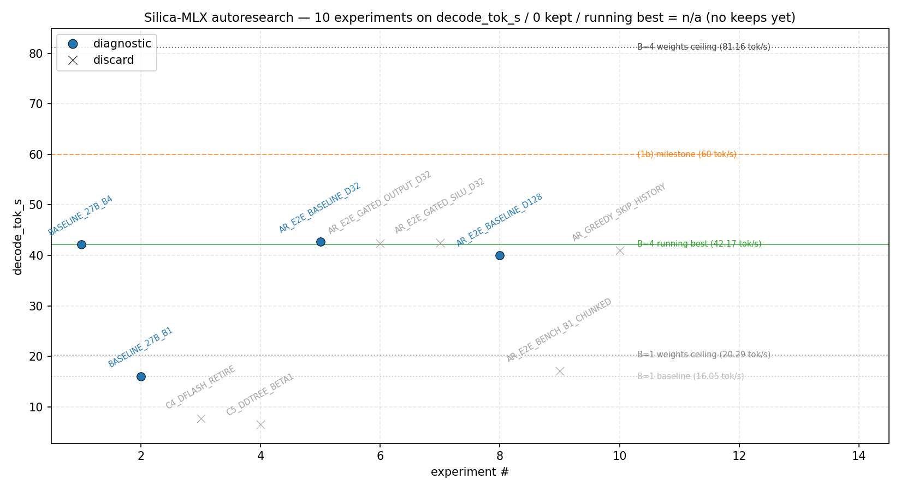
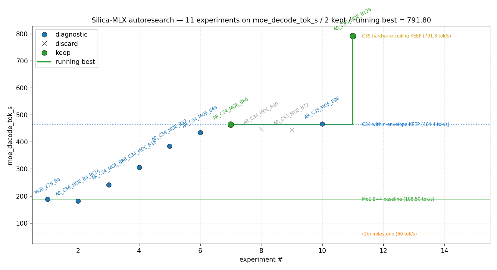

<p align="center">
  
</p>

<h1 align="center">silica-mlx</h1>

<p align="center">
  <a href="https://silica-mlx.readthedocs.io/en/latest/?badge=latest"></a>
  <a href="https://www.python.org/downloads/"></a>
  <a href="https://opensource.org/licenses/Apache-2.0"></a>
  <a href="https://www.apple.com/mac/"></a>
</p>

**Continuous-batching LLM serving on Apple Silicon — vLLM-core
architecture, MLX-native.**

The continuous batching, memory-budget admission, preempt/replay, and
radix prefix cache that production-grade serving frameworks rely on,
ported to MLX's unified-memory model. Native KV codec compression
(BlockTQ / RaBitQ) shipped. Multi-family adapters with batched-output
parity validated against a direct mlx-lm batched reference: Qwen3
dense, Qwen3.5 hybrid DeltaNet, Gemma4-31B dense, Qwen3.5-35B-A3B MoE,
gemma-4-26B-A4B MoE.

Target hardware: M5 Pro 48 GB. Runs Qwen3 (0.6B / 4B / 7B / 14B /
32B), Qwen3.5 hybrid (0.8B / 4B / 27B), Gemma4-31B dense,
Qwen3.5-35B-A3B MoE, gemma-4-26B-A4B MoE.

> **Status (v1.7.24):** the scheduler core (continuous batching,
> prefix cache, memory budget), multi-family adapters, KV codec
> compression, and the speculative-decoding foundation
> (`DraftTargetEngine` + three rollback paths + spec-metrics
> emission + `--speculative` bench switch — D-021 step 5) are
> shipped. **The 35-cycle P-6 autoresearch loop closed in May 2026
> with all four acceptance gates cleared 3.4-5.5× over the cycle-1
> baseline** — 232 tok/s on dense Qwen3.5-27B-4bit at the 48 GB
> hardware ceiling, 791.8 tok/s on MoE Qwen3.5-35B-A3B-4bit at
> B=128. Two load-bearing levers: batched-aggregate axis-shift
> (cycle 10) × bf16 DeltaNet recurrent state (cycle 12); 17 custom
> Metal kernel attempts closed without a load-bearing E2E win on
> mlx 0.31.x (see § Performance). D-022 small-B interactive QoE is
> the next active research line. OpenAI HTTP server and weight
> streaming for MoE residency remain stubs behind frozen
> interfaces.

> **Website.** Project homepage at
> [ivis4ml.github.io/silica-mlx](https://ivis4ml.github.io/silica-mlx/)
> — overview, architecture, scheduler animation, REPL preview,
> roadmap. Source under [`site/`](site/), published by the Pages
> workflow at
> [`.github/workflows/deploy-site.yml`](.github/workflows/deploy-site.yml)
> on every push that touches `site/` (no build step; static React +
> Babel-standalone).

> **Documentation.** Hosted Sphinx site at
> [silica-mlx.readthedocs.io](https://silica-mlx.readthedocs.io/en/latest/)
> — overview, chat-CLI guide, benchmark guide, manual + autodoc
> API, curated plans index. Quick links on GitHub:
> [chat-CLI guide](CHAT.README.md) · [API reference](docs/API.md) ·
> [plans index](docs/plans-index.md) · [PLAN](plans/PLAN.md). For all
> three reading paths (GitHub direct, local Sphinx, RTD) see
> [§ Documentation](#documentation) below.

---

## Why silica-mlx

| Capability | mlx-lm | vLLM | SGLang | silica-mlx |
| --- | --- | --- | --- | --- |
| Backend | MLX | CUDA | CUDA | MLX |
| Continuous batching | ✗ | ✅ | ✅ | ✅ |
| Radix prefix cache | ✗ | limited (block-level) | ✅ | ✅ |
| Memory-budget admission ladder | ✗ | ✅ | ✅ | ✅ |
| Preempt + replay | ✗ | ✅ | ✅ | ✅ |
| Native KV codec compression | ✗ | limited (FP8 / INT8) | limited | ✅ (BlockTQ + RaBitQ family) |
| Hybrid DeltaNet (Qwen3.5) — batched | limited (single-request) | ✗ | ✗ | ✅ |
| MoE batched dispatch | limited (single-request) | ✅ | ✅ | ✅ |
| OpenAI-compatible HTTP server | ✗ | ✅ | ✅ | planned |
| Speculative decoding | ✗ | ✅ | ✅ | planned |
| Per-expert MoE residency | ✗ | limited | ✗ | planned |

**Niche.** silica-mlx is an MLX-native serving framework that combines
the vLLM scheduler core (continuous batching + memory budget +
preempt/replay) with a radix prefix cache and a KV codec compression
layer on a single integrated runtime. mlx-lm is single-request and
solves a different problem; vLLM and SGLang are CUDA-first and don't
run on Apple Silicon. silica-mlx is not feature-complete relative to
either yet — see "What's planned" below for the gap.

---

## Performance — P-6 autoresearch closed at v1.7.23

<table>
<tr>
<td width="50%"></td>
<td width="50%"></td>
</tr>
</table>

<sub>Karpathy-style autoresearch ledgers — each dot is a measurement, the ladder is the running best. <strong>Left:</strong> dense Qwen3.5-27B-4bit, 38 experiments, 9 KEEPs, baseline 42.17 tok/s @ B=4 (cycle 1) → 232 tok/s @ B=64 (cycle 28). <strong>Right:</strong> MoE Qwen3.5-35B-A3B-4bit, 11 experiments, 2 KEEPs, baseline 188.5 tok/s @ B=4 → 791.8 tok/s @ B=128 (cycle 35) — the largest absolute throughput observed across the full effort.</sub>

The 35-cycle opus autoresearch loop pushed Qwen3.5-27B-4bit warm
decode 5.50× over the cycle-1 baseline on M5 Pro 48 GB. Two
load-bearing levers — `cycle-10` batched-aggregate axis-shift
(B=4 → B=52) and `cycle-12` bf16 DeltaNet recurrent state (3.5 GB
peak save opens B≥48 within the 36 GB envelope) — composed to
clear all four P-6 acceptance gates 3.4-5.5× over baseline.
**17 custom Metal kernel attempts closed without a load-bearing
E2E win**; the unlock came from data layout (bf16 state) and
operating-point selection (axis-shift), not from a custom
attention or QMM kernel.

### Acceptance gates — every P-6 gate cleared

| Gate | Target | Cleared | Multiplier | Frame |
| --- | --- | --- | ---: | --- |
| (1a) Dense engineering | ≥40 tok/s | 204 ± 1 tok/s | **4.85×** | B=52 · 36 GB envelope |
| (1b) Dense stretch | ≥60 tok/s | 231.9 ± 0.3 tok/s | **3.87×** | B=64 · 48 GB hardware ceiling |
| (2a) MoE anchor | ≥100 tok/s | 120.93 tok/s (preserved) | — | MoE B=2 · v1.7.13 baseline |
| (2b) MoE stretch | ≥175 tok/s | 791.8 ± 5.2 tok/s | **4.52×** | MoE B=128 · 48 GB hardware ceiling |

<details>
<summary><strong>Headline numbers</strong> — full table with envelope vs hardware-ceiling framing</summary>

| Metric | Value | Frame |
| --- | ---: | --- |
| Dense 27B decode (envelope) | **204 ± 1 tok/s** | `mlx-community/Qwen3.5-27B-4bit` · B=52 · 36 GB · n=6 across 2 sessions |
| Dense 27B decode (hardware ceiling) | **231.9 ± 0.3 tok/s** | B=64 · 48 GB · n=3 |
| MoE 35B-A3B decode (envelope) | **464.1 ± 0.7 tok/s** | `mlx-community/Qwen3.5-35B-A3B-4bit` · B=64 · 33.8 GB · n=3 |
| MoE 35B-A3B decode (hardware ceiling) | **791.8 ± 5.2 tok/s** | B=128 · 47.96 GB · n=3 |
| Dense uplift from cycle-1 baseline (42.17 tok/s @ B=4) | **5.50×** at B=64 / **4.85×** at B=52 | — |
| MoE uplift from cycle-1 baseline (188.5 tok/s @ B=4) | **4.20×** at B=128 / **2.46×** at B=64 | — |

</details>

<details>
<summary><strong>Two load-bearing levers</strong> — running-best is composition, not a kernel</summary>

- **Cycle 10 — batched-aggregate axis-shift.** Re-reading the
  P6_AUTORESEARCH.md metric definition ("B is chosen to maximise aggregate")
  moved the operating point from B=4 → B=48 within the 36 GB
  envelope. Pure parameter selection; no kernel change. *4.60× on
  its own.*
- **Cycle 12 — bf16 DeltaNet recurrent state.** State shape
  `[B, Hv=48, Dv=128, Dk=128]` is 144 MB at fp32 per layer,
  72 MB at bf16. Across 48 DeltaNet layers the peak-memory save
  is ~3.5 GB — opens B≥48 within envelope and unlocks B=64 at
  hardware ceiling.
- **Cycle 13 — composition.** Cycle-12's peak save composed with
  cycle-10's B-axis lever produces the running-best line. The two
  levers are independent; together they dominate every later
  atomic probe.

Cycle 30 explained why kernel work didn't pay back: at B=64 with
the v10+bf16 stack, DeltaNet owns 88% of step time, full-attn
12.5%, dispatch 0.3% — and mlx's existing `gated_delta` kernel
is already at HBM-bandwidth limit (cycle-31 silica
`gated_delta_v2` = 1.001× vs mlx). Source-string Metal kernels in
mlx 0.31.x do not pay back on dense 27B.

</details>

<details>
<summary><strong>Honest record</strong> — closures and a retraction</summary>

- **Spec-decode at production B — closed with measurement-anchored
  negative.** Cycle 23 measured the `B × k` verify-cost matrix:
  B=52 k=64 = **8105 ms** vs same-B plain-decode ~252 ms / step.
  Tree-spec at b=64 recomputes to ~10 tok/s aggregate, a 20×
  regression vs plain decode. No B regime in {1, 4, 16, 52} where
  spec-decode beats plain on this stack. Track C settles: C.4
  retired (η.1 = 0.482×), C.5 retired (cycle-23 closure),
  C.1 / C.2 / C.3 / C.6 deprioritised since (1b) no longer needs
  them.
- **Dense B-axis past 64 — closed at the architectural cliff.**
  Cycles 28-29 measured a 26% throughput drop at the B=64 → B=66
  transition (40 GB peak boundary). Three allocator-hint probes
  (`mx.metal.set_cache_limit / set_memory_limit /
  set_wired_limit`) leave the cliff in place — architectural,
  likely M5 Pro SLC threshold or unified-memory bandwidth
  contention near the 48 GB cap, not allocator policy.
- **Cycle 14's claimed v10 KEEP — retracted via codex review.** A
  codex cross-review on the `opus-codex` branch caught a 14-cycle
  dtype-defect in `silica.kernels.shadow_install`
  (`queries.dtype == mx.float16` silently skipped the bf16
  production path). After the fix, an 8-rep reverify (cycles
  27 / 28) measured v10's E2E contribution at +0.5 tok/s @ B=52 /
  −1.7 tok/s @ B=64 — both within noise. The honest running-best
  is C10 axis-shift × C12 bf16 DeltaNet state composition alone;
  the retracted KEEP is published as part of the research record.

</details>

<details>
<summary><strong>Methodology</strong> — Karpathy-style ledger and variance discipline</summary>

Karpathy-style autoresearch ledger (one TSV row per measurement;
the main agent appends, sub-agents return findings). Variance
discipline: ≥3 reps per session, ≥2 sessions, combined σ check
before declaring a KEEP. Cycle 33's combined σ at B=52 across
2 sessions tightened to 0.83 tok/s on n=6 — that protocol is the
standard, not the exception. Toolchain pin: `mlx==0.31.1`,
`mlx-lm==0.31.2`, `mlx-metal==0.31.1`. Determinism gate:
`tests/test_p2_preload_parity.py` (3/3 pass).

</details>

<details>
<summary><strong>Reproducibility</strong> — three commands</summary>

```bash
# Dense 27B within 36 GB envelope (running-best 204 tok/s)
SILICA_USE_BF16_DELTANET_STATE=1 \
    SILICA_REAL_QWEN3_5_27B=1 \
    uv run --extra bench python -m scripts.bench \
        --scenario qwen3.5-27b-warm-decode-b52 \
        --out /tmp/repro_b52_bf16.jsonl

# Dense 27B at 48 GB hardware ceiling (running-best 232 tok/s)
SILICA_USE_BF16_DELTANET_STATE=1 \
    SILICA_REAL_QWEN3_5_27B=1 \
    uv run --extra bench python -m scripts.bench \
        --scenario qwen3.5-27b-warm-decode-b64 \
        --out /tmp/repro_b64_bf16.jsonl

# MoE 35B-A3B at 48 GB hardware ceiling (running-best 791.8 tok/s)
SILICA_USE_BF16_DELTANET_STATE=1 \
    SILICA_REAL_QWEN3_5_MOE=1 \
    uv run --extra bench python -m scripts.bench \
        --scenario qwen3.5-moe-35b-a3b-warm-decode-b128 \
        --out /tmp/repro_moe_b128.jsonl
```

n=3 reps recommended per scenario. Combined σ is typically
~1 tok/s on dense B=52 and ~5 tok/s on MoE B=128 in the same
environment with proper warm cache.

</details>

### Read more

[`P6_AUTORESEARCH_NOTES.md`](plans/P6_AUTORESEARCH_NOTES.md) ·
[`P6_AUTORESEARCH_FINAL_REPORT.md`](plans/P6_AUTORESEARCH_FINAL_REPORT.md) ·
[`P6_AUTORESEARCH.md`](P6_AUTORESEARCH.md) ·
[`P6_AUTORESEARCH_LOG.tsv`](plans/P6_AUTORESEARCH_LOG.tsv) (110-row ledger) ·
[`P6_AUTORESEARCH/`](plans/P6_AUTORESEARCH/) (35 per-cycle reports) ·
[`P6_SMALL_B_OPENING.md`](plans/P6_SMALL_B_OPENING.md) (D-022 next line)

---

## Highlights — what's shipped

- **vLLM-core scheduler.** Continuous batching with a memory-budget
  admission ladder (admit → evict → preempt → reject) and
  preempt+replay (save composite prompt, re-enter queue).
  Single-request and batched generation share one code path.
- **Radix prefix cache.** Block-granular radix-trie reuse with a
  per-codec store seam. Block-aligned prefix hits seed the per-row
  KV cache; miss-prefill chunks insert blocks back into the tree on
  row termination.
- **Native KV codec compression.** `BlockTurboQuantMSE` (B=64 4-bit)
  matches vqbench/REPORT.md's lossless-at-measurement-precision
  baseline on Qwen3.5-4B WikiText-2 (mean ΔPPL = +0.0016 PPL across
  three seeds, statistically indistinguishable from vqbench's
  reported `+0.000% ± 0.000%`). `RaBitQ1Bit` and `ExtRaBitQ`
  (2 / 3 / 4-bit) ship alongside.
- **Multi-family adapters.** Qwen3 dense (0.6B–32B), Qwen3.5 hybrid
  DeltaNet (0.8B / 4B / 27B), Gemma4-31B dense, Qwen3.5-MoE (35B-A3B,
  256 experts × top-8), Gemma4-MoE (26B-A4B, 128 experts × top-8).
  Each family has batched output parity validated against a direct
  mlx-lm batched reference using the same per-layer cache types and
  left-padding convention.
- **Hybrid DeltaNet on the batched path.** Recurrent-state snapshot
  and restore unlock `RadixPrefixCache + Qwen3.5 hybrid` cooperation
  end-to-end on real Qwen3.5-0.8B.
- **Bench harness.** 15+ registered scenarios across five oracle
  types (smoke, B=1 parity, B>1 direct-reference, teacher-forced
  argmax, WikiText-2 perplexity) producing JSONL + Markdown reports
  with an optional vqbench subprocess cross-check column. One
  command runs the entire catalogue.
- **CLI + Python API.** `silica run` single-shot;
  `silica chat` (or bare `silica`) — full `prompt_toolkit` REPL
  with live toolbar (tok/s, KV residency, prefix-hit, finish
  reason), `/continue` for `max_tokens`-truncated turns,
  `/regenerate`, `/save` · `/load`, `/model` swap (with
  `--keep-history`), `/system`, `/showcase` session narrative;
  plus `Engine.generate` / `Engine.generate_batch` and
  `ChatSession.chat` / `ChatSession.continue_last` for direct
  embedding.

---

## What's planned

The engine main loop already carries stub implementations behind
frozen interfaces; the planned phases progressively replace those
stubs without changing call sites.

- **Weight streaming for MoE residency.** Dense layer prefetch plus
  per-expert residency for MoE checkpoints. Target: Qwen3.5-35B-A3B's
  active-3B / total-35B residency footprint under tighter memory
  budgets without OOM, with decode throughput close to the resident
  baseline. Today, everything stays resident.
- **Speculative decoding.** Draft-target speculation foundation
  closed at v1.7.19 (D-021 step 5): `DraftTargetEngine`, multi-token
  verify forward, target-side KV / recurrent / draft-side rollback,
  cycle-1 byte-equal greedy parity on cached Qwen3-0.6B and
  Qwen3.5-0.8B, the seven-field `silica.bench.spec_metrics` schema
  emitted into `ScenarioResult.metadata`, and a `--speculative
  draft_target` bench switch with two real-model warm-decode rows
  (`qwen3.5-27b-warm-decode-spec-on` and
  `qwen3.5-moe-35b-a3b-warm-decode-spec-on`). Multi-request hybrid
  batched-spec is deferred (`(c)` slice 3, non-blocking for
  foundation correctness). EAGLE / Medusa style schemes are out of
  scope for v0.1.
- **OpenAI-compatible HTTP server.** `silica-server` binary with
  OpenAI-compatible chat / completions endpoints, plus a session
  layer for per-conversation prefix caching across HTTP requests.
  This is the SGLang-style outer layer of the framework.

Paged-attention codec integration is deferred until MLX exposes a
variable-length SDPA kernel.

---

## Status — phase board

| Phase | Scope | State |
| --- | --- | --- |
| P-0 | Core skeleton, frozen interfaces, sampler | ✅ complete |
| P-1 | Single-request `Engine.generate` | ✅ complete |
| P-2 | Continuous batching, radix prefix cache, memory-budget admission, preempt+replay | ✅ complete |
| P-3 | Family adapters — Qwen3 dense, Qwen3.5 hybrid DeltaNet, Gemma4-31B dense, Qwen3.5-MoE, Gemma4-MoE | ✅ complete on the supported batched surface (C5 slice-prefill α-MVP; E4 batched MoE smoke + scheduler-glue parity at v1.7.9) |
| P-4 | Unified bench harness — runner, oracles, 15 scenarios, JSONL + Markdown reports, vqbench subprocess PPL | ✅ complete |
| P-4.5 | P-4 exit bridge — chunked-prefill minimal + VectorCodec runtime integration spike | ✅ complete (v1.6.9) |
| P-5 | VQ KV compression (BlockTQ / RaBitQ) | ✅ complete (v1.7.4 — Acceptance (1)–(4) closed; P-5-F production routing closed at v1.7.6; (b-static) Qwen3.5-4B baseline closed at v1.7.7; per-head opt-in + measurements at v1.7.8 / v1.7.10 / v1.7.11) |
| P-6 | Performance phase (dense Qwen3.5-27B-4bit ≥40 tok/s primary, ≥60 stretch; MoE 35B-A3B ≥100 anchor cleared, ≥175 aggregate stretch) | ✅ acceptance gates cleared at v1.7.23 — (1a)/(1b)/(2b) all cleared 3.4-5.5× over the cycle-1 baseline via the 35-cycle opus autoresearch loop (axis-shift × bf16 DeltaNet state composition; see § Performance). D-021 step 5 spec foundation closed at v1.7.19. Track B 3-bit retired at v1.7.21 (B.2 PPL gate FAIL). Track C.4 retired at v1.7.20 (η.1 = 0.482×). Track C.5 retired at v1.7.22 (production-B verify-cost wall). D-022 small-B interactive QoE (B ∈ {1, 2, 4, 8, 12}) opened at v1.7.24 as the next active research line; Track A reframes from "ships after spec foundation" to next-research lead. Dense layer-streaming deferred to v0.2 per D-018. |
| P-7 | Speculative decoding (DraftTarget / EAGLE / Medusa) | Promoted to T1 at v1.7.13; `DraftEngine` interface frozen. Foundation deliverables (`DraftTargetEngine` + engine integration + spec-metrics + bench switch) closed at D-021 step 5 (v1.7.19). ≥1.2× decode-throughput acceptance has now been settled with a measurement-anchored negative: opus cycle 23 measured the B × k verify-cost matrix on dense Qwen3.5-27B-4bit (B=52 k=64 = 8105 ms vs same-B plain decode ~252 ms / step) — tree-spec recomputes to ~10 tok/s aggregate, a net regression by 20× vs plain decode, with no B regime in {1, 4, 16, 52} where any spec variant beats plain. Track C.4 / C.5 both retired with negatives in P-6. Re-opening requires a fundamentally different verifier with measured sub-linear cost at production batch. EAGLE / Medusa stay v0.2. |
| P-8 | OpenAI-compatible HTTP server + session layer | ⏳ planned (T1 tail, after P-5) |

Legend: ✅ shipped · Stub = wired as the baseline implementation
behind the frozen interface, swappable in P-6 / P-7 · ⏳ = not started.

Single-source-of-truth for the roadmap and decisions log:
[`plans/PLAN.md`](plans/PLAN.md).

---

## Install

Requires Python 3.12+ and an Apple Silicon Mac. Managed via
[uv](https://github.com/astral-sh/uv).

```bash
uv pip install -e .
# chat REPL extras (prompt_toolkit + pygments)
uv pip install -e '.[chat]'
# optional extras for the planned HTTP serve path (P-8, not yet wired)
uv pip install -e '.[serve]'
# documentation tooling (Sphinx + MyST + Furo theme)
uv pip install -e '.[docs]'
```

Runtime deps: `mlx>=0.22`, `mlx-lm>=0.18`, `numpy>=1.26`, `pydantic>=2`.
Dev deps (`pytest`, `ruff`, `mypy`) live in the `dev` group.

Build the docs site (after the `[docs]` extras):

```bash
make -C docs html
open docs/_build/html/index.html
```

---

## Quickstart

Five entry points: `silica run` (single-shot CLI), `scripts/chat.py`
(REPL chatbot), the Python API (single request + continuous batching),
and `scripts/bench.py` (benchmark harness).

### 1. CLI — single prompt

```bash
python -m silica run \
    --model Qwen/Qwen3-0.6B \
    --prompt "The capital of France is" \
    --max-tokens 64 \
    --temperature 0.0
```

Prints `prompt + generation` to stdout and a one-line metrics row
(`ttft=… prefill=…tok/s decode=…tok/s resident=…MB`) to stderr.
The console script `silica run …` is equivalent once the package is
installed.

### 2. CLI — chat REPL

```bash
silica chat --model Qwen/Qwen3-0.6B --system "You are concise."
silica chat --model Qwen/Qwen3.5-4B --kv-codec block_tq_b64_b4
silica            # bare-launch — claude-style; --model becomes implicit
```

Bare `silica` (no subcommand) is rewritten to `silica chat ...` at
parse time. The script alias `python scripts/chat.py ...` exposes the
same launch surface.

Opens a multi-turn REPL that streams each reply token-by-token over a
persistent bottom toolbar showing `state= · tok/s · tokens=N/max ·
ttft · peak · kv · prefix_hit=N/M · finish=`. When a turn ends at
`finish_reason=max_tokens` a yellow `[truncated: /continue]` marker
prints below the reply, advertising the path forward.

Slash commands:

| Command | Effect |
| --- | --- |
| `/help` | List every command + the full `/config` schema |
| `/exit` · EOF | Quit the REPL |
| `/reset` | Drop conversation log + invalidate prefix cache |
| `/system "..."` | Replace the live system prompt (empty arg clears) |
| `/config key=value` | Adjust runtime config (`temperature`, `max_tokens`, `thinking_mode`, `thinking_history`, `live_toolbar`, ...) |
| `/regenerate` | Redo the previous turn with a fresh sample (rollback on abort) |
| `/continue` | Extend the previous turn when it stopped at `max_tokens` |
| `/save <path>` · `/load <path>` | Persist / restore conversation as JSON |
| `/model <repo>` · `/model <repo> --keep-history` | Swap model (default resets history; `--keep-history` re-tokenises stored text against the new tokeniser) |
| `/expand` | Reprint the previous turn's collapsed `<think>` content |
| `/showcase` | One-paragraph session narrative (turns, prefix reuse, avg decode, last finish, last-turn reasoning/visible char split, `/continue` calls) |

Launch flags (sampling knobs intentionally **not** CLI flags — adjust
mid-session via `/config`):

| Flag | Purpose |
| --- | --- |
| `--model` | HuggingFace repo id (e.g. `Qwen/Qwen3-0.6B`, `Qwen/Qwen3.5-4B`) |
| `--system` | Initial system prompt; omit for the bundled concise default; pass `""` for no system |
| `--kv-codec` | KV codec id (e.g. `block_tq_b64_b4`); omit for fp16 |

Without `--system`, `silica chat` ships a concise default ("answer
directly, skip preamble, stop when complete"). Override with
`--system "..."` or clear with `--system ""`. To disable Qwen3's
`<think>` reasoning phase entirely (saves tokens), run
`/config thinking_mode=off` once inside the REPL.

### 3. Python API — single request

```python
from silica import Engine
from silica.core.sampling import SamplingParams
from silica.models.factory import adapter_for_repo

adapter, kv = adapter_for_repo("Qwen/Qwen3-0.6B")
engine = Engine(adapter, kv)

tokenizer = adapter.tokenizer()
params = SamplingParams(
    temperature=0.7,
    top_p=0.9,
    max_tokens=128,
    stop_token_ids=tuple(tokenizer.eos_token_ids or ()),
)

token_ids = list(engine.generate("Write a haiku about silicon.", params))
print(tokenizer.decode(token_ids))
print(engine.metrics.snapshot())
```

`Engine.generate` is an iterator — consume it however you want
(streaming to stdout, collecting into a list, piping into a
detokenizer). The iterator auto-releases KV on exhaustion or
exception.

### 4. Python API — continuous batching

```python
from silica import Engine
from silica.kvcache.prefix import RadixPrefixCache
from silica.kvcache.store import SyntheticPrefixBlockStore
from silica.models.factory import adapter_for_repo

adapter, kv = adapter_for_repo("Qwen/Qwen3-0.6B")
engine = Engine(adapter, kv)

block_size = 16
pc = RadixPrefixCache(
    block_size=block_size,
    store=SyntheticPrefixBlockStore(block_size=block_size),
)

for event in engine.generate_batch(prompts, params, max_batch_size=8, prefix_cache=pc):
    ...   # event.kind ∈ {"token", "done", "aborted"}
```

`generate_batch` yields `BatchEvent` values; `req_index` matches the
position in the `prompts` list. The full surface (`MemoryBudgeter`,
`ContinuousBatcher`, the codec wiring on `SyntheticPrefixBlockStore`)
is documented under
[`silica.engine`](docs/api/silica.engine.md) and
[`silica.scheduler`](docs/api/silica.scheduler.md) in the docs site.

### 5. Python API — multi-turn chat session

```python
from silica import Engine
from silica.chat import ChatSession
from silica.models.factory import adapter_for_repo

adapter, kv = adapter_for_repo("Qwen/Qwen3-0.6B")
engine = Engine(adapter, kv)
session = ChatSession(adapter, engine, system_prompt="Be concise.")

import sys
def stream_to_stdout(delta: str) -> None:
    sys.stdout.write(delta); sys.stdout.flush()

m = session.chat("Explain TTFT in one sentence.", stream_to=stream_to_stdout)
print()  # newline after stream
print(f"TTFT={m.ttft_ms:.1f}ms  decode={m.decode_tok_s:.1f}tok/s  "
      f"peak={m.peak_memory_mb:.1f}MB  finish={m.finish_reason}")

m = session.chat("Now explain decode tok/s.", stream_to=stream_to_stdout)
```

`ChatSession` wraps `Engine.generate` with OpenAI-style message
history, the tokenizer's `apply_chat_template` (Qwen-style
`<|im_start|>` fallback when unavailable), and per-turn
[`TurnMetrics`](silica/chat/session.py) — TTFT, prefill tok/s,
decode tok/s, resident KV, peak memory, logical KV bytes, wall
seconds, and finish reason. `session.reset()` drops every message
except the system prompt.

Three additional ctor knobs cover the chat-CLI's response-policy
surface (Qwen3 family with `enable_thinking=True`):

- `thinking_mode: bool | None` — threaded as `enable_thinking` to
  `apply_chat_template` so `/config thinking_mode=on|off` actually
  changes what the model reasons about. `None` keeps the
  tokeniser's default.
- `thinking_history: "strip" | "keep"` — `strip` (default) removes
  `<think>...</think>` content from `messages[-1].content` after
  each turn so the next turn's prompt does not re-feed cumulative
  reasoning; `keep` preserves the raw decoded reply for archival
  use cases.
- `implicit_thinking_supported: bool` — `True` for Qwen3 / Qwen3.5
  templates that prepend `<think>\n` to the assistant slot.

When a turn ends at `finish_reason="max_tokens"`, the assistant
message holds the raw prefix (deferred-finalise contract); call
`session.continue_last()` to extend the same message in place
without inserting a new `(user, assistant)` pair. Chained
`continue_last` is supported.

### 6. Benchmark harness

```bash
python -m scripts.bench --all --out bench-results.jsonl --report-md bench-results.md
python -m scripts.bench --scenario qwen3-0.6b-bgt1-parity
python -m scripts.bench --list

# D-021 step 5 (h) — speculative-decoding bench rows. Quad-gated:
# target HF cache + target env var + drafter HF cache (Qwen3.5-0.8B)
# + drafter env var (SILICA_REAL_QWEN3_5_0_8B_DRAFT). Without
# --speculative draft_target the row degrades to plain warm-decode
# against the target alone (drafter checks skipped; spec-off path,
# byte-identical to the b1 baseline).
SILICA_REAL_QWEN3_5_27B=1 SILICA_REAL_QWEN3_5_0_8B_DRAFT=1 \
  python -m scripts.bench \
  --speculative draft_target \
  --scenario qwen3.5-27b-warm-decode-spec-on \
  --out spec-on.jsonl
```

Full guide — scenario catalog, dual-gate env vars, `--all-kv-codecs`
sweep, `--vqbench-xcheck` cross-check column, `--speculative` /
spec-on rows — lives in [`docs/bench.md`](docs/bench.md).

---

## Running the tests

```bash
uv run pytest tests           # full suite (currently ~2616 tests, ~95 s)
uv run ruff check .
uv run mypy silica
```

The suite includes the PLAN §7 P-2 acceptance triad:

- `tests/test_p2_batched_parity.py::test_generate_batch_real_8_concurrent` — 8 concurrent prompts run stably.
- `tests/test_p2_batched_parity.py::test_prefix_hit_reduces_forward_tokens` — shared-prefix hit verifiable from `ContinuousBatcher.forward_prompt_tokens`.
- `tests/test_p2_batched_parity.py::test_budget_overflow_aborts_cleanly` — budget overflow queues (preempt branch) or aborts (reject branch) cleanly.

Real-model tests download Qwen3-0.6B via mlx-lm on first run
(~1.2 GB). Dual-gated real-model smokes (Gemma4-31B, Qwen3.5-27B,
both MoE families) are skipped unless the corresponding
`SILICA_REAL_*=1` env var is set.

---

## Layout

The repository ships fifteen `silica.*` subpackages — `core`,
`engine`, `scheduler`, `kvcache`, `models`, `weights`, `vq`,
`speculative`, `bench`, `chat`, `server`, `mlx`, plus the `llm`
stub. The five frozen interfaces — `ModelAdapter` (I-1), `KVManager`
(I-2), `VectorCodec[P]` (I-3, side-level since P-5-A.0.4),
`WeightProvider` (I-4), `DraftEngine` (I-5) — are `typing.Protocol`s
defined in their respective subpackages and are the integration
points for native capabilities (Principle 9 in PLAN.md).

For the per-subpackage walk-through with auto-generated symbol
listings, see [`docs/api/index.md`](docs/api/index.md) (or
`docs/_build/html/api/index.html` after `make -C docs html`).

---

## Documentation

Three reading paths depending on how much rendering you want:

**1. Browse on GitHub (no setup).** All design docs and the
hand-curated API reference live as plain Markdown — readable
in-browser via the `Code` tab:

- [`README.md`](https://github.com/Ivis4ml/silica-mlx/blob/main/README.md)
  (this page) — install, quickstart, status board.
- [`CHAT.README.md`](https://github.com/Ivis4ml/silica-mlx/blob/main/CHAT.README.md)
  — `silica chat` REPL: install, slash commands, default system
  prompt, three-axis thinking model, how to disable Qwen3
  reasoning.
- [`docs/API.md`](https://github.com/Ivis4ml/silica-mlx/blob/main/docs/API.md)
  — hand-curated per-module API reference (every public class,
  function, protocol).
- [`docs/plans-index.md`](https://github.com/Ivis4ml/silica-mlx/blob/main/docs/plans-index.md)
  — curated entry into `plans/` (per-phase opening / prep /
  survey / acceptance docs and side tracks).
- [`plans/PLAN.md`](https://github.com/Ivis4ml/silica-mlx/blob/main/plans/PLAN.md)
  — single source of truth for phases, decisions, open questions.

**2. Build the Sphinx site locally** (rendered cross-references,
search, autodoc):

```bash
uv pip install -e '.[docs]'
make -C docs html
open docs/_build/html/index.html      # macOS; or xdg-open / start
```

The site bundles the overview, chat-CLI guide, benchmark guide,
auto-generated API, manual API page, and the curated `plans/`
index. Files that use MyST `{toctree}` / `{include}` directives
render best in this mode.

**3. Hosted on Read the Docs** (zero-build, public URL):
[silica-mlx.readthedocs.io/en/latest](https://silica-mlx.readthedocs.io/en/latest/).
The site rebuilds automatically on every push; configuration lives
in [`.readthedocs.yaml`](.readthedocs.yaml) (Ubuntu 22.04, Python
3.12, the `[docs]` extras pulled from `pyproject.toml`). Use this
when you want rendered cross-references and full-text search
without any local toolchain.

### Project homepage (`site/`)

The marketing-style homepage at
[ivis4ml.github.io/silica-mlx](https://ivis4ml.github.io/silica-mlx/)
lives under [`site/`](site/) as a static React + Babel-standalone
single-page app — no build step. To preview locally before
pushing:

```bash
cd site
python3 -m http.server 8765
# then open http://localhost:8765/ in a browser
```

The browser fetches React / ReactDOM / Babel-standalone via
unpkg.com CDN at load time and compiles the component JSX in-page,
so the only requirements are Python 3 and a network connection on
first load (browser caches afterwards). Edit any
[`components/*.jsx`](site/components/) or
[`app.jsx`](site/app.jsx) and refresh — no rebuild.

GitHub Pages publishes `site/` on every push that touches the
directory via [`.github/workflows/deploy-site.yml`](.github/workflows/deploy-site.yml).

---

## Roadmap

Phases P-0 through P-5 are closed (see the *Status* table). The
detailed sub-unit decomposition, decisions log, and acceptance
evidence live in [`plans/PLAN.md`](plans/PLAN.md) — what follows is
the structural picture only.

- **P-3-E4** *(closed at v1.7.9)* — batched MoE smoke + scheduler-
  glue parity vs direct mlx-lm batched reference. Per-expert
  streaming is P-6 scope.
- **P-3-C5** *(closed at C5.5 α-MVP)* — preempt/replay with
  recurrent-state snapshot on hybrid DeltaNet, slice-prefill regime.
- **P-5** *(closed at v1.7.4)* — KV codec stack (BlockTQ + RaBitQ).
  Acceptance items (1)–(4) all closed; production-path pre-norm
  routing closed at P-5-F (v1.7.6); Qwen3.5-4B (b-static) PPL
  baseline closed at v1.7.7. Per-head Haar rotation lands as opt-in
  (default OFF) at v1.7.8 with empirical re-measurements at v1.7.10
  / v1.7.11. The single intentionally-deferred deliverable is
  `PagedPrefixBlockStore` codec injection — waiting on the paged-
  attention kernel track per D-003.
- **P-6** *(in progress)* — performance phase. Re-scoped at v1.7.13
  (D-017 / D-018 / D-019) from "weight streaming" to engineering
  silica to a dense Qwen3.5-27B-4bit primary of ≥40 tok/s on M5 Pro
  48 GB plus a MoE 35B-A3B ≥175 tok/s aggregate stretch. P-6.0
  measurement gate landed at v1.7.13 (8 scenarios + REPORT in
  `plans/P6_0_BASELINE/`); P-6.0.5 measurement expansion landed at
  v1.7.17 (8 artefacts in `plans/P6_0_5_BASELINE/` covering dense /
  MoE batch scaling, 4K-context, warm-TTFT, and a target-verify
  microbench); Decision Gate 1 (D-021 step 4) closed at v1.7.18 with
  a two-condition (1b) survival rule (full-stack measurement clears
  ≥60, OR Track C.5 tree-shape spike beats the linear k=8 verify
  ceiling) — see `plans/P6_0_DECISION_GATE_1_OPENING.md`. **D-021
  step 5 spec foundation closed at v1.7.19** —
  `silica.speculative.draft_target.DraftTargetEngine` wired into
  `Engine.generate`, three rollback paths bound (target-side KV,
  recurrent state on Qwen3.5 hybrid via snapshot/restore + replay,
  draft-side via `DraftTargetEngine.commit`), cycle-1 byte-equal
  greedy parity on cached Qwen3-0.6B + Qwen3.5-0.8B, the v1.7.15
  spec-metrics schema emitted via `SpecMetricCollector`, and the
  `--speculative {none,draft_target}` CLI flag plus two real-model
  warm-decode scenarios (`qwen3.5-27b-warm-decode-spec-on` /
  `qwen3.5-moe-35b-a3b-warm-decode-spec-on`, both quad-gated on HF
  cache + env var for target and drafter). Multi-request hybrid
  batched-spec ((c) slice 3) deferred as a non-blocking performance
  extension; the `ContinuousBatcher` GLOBAL-only gate stays in
  place. ≥1.2× decode-throughput acceptance is tracked-not-blocking
  at foundation closure and rolls into Track C.4 / C.5. Tracks A
  (engine fusion), B (3-bit weights), C.4 / C.5 spec extensions, D
  (concurrency TTFT), E (paged-attention) queued behind the gate.
  Dense layer-streaming and per-expert MoE residency deferred to
  v0.2 per D-018; the `WeightProvider` interface stays frozen.
- **P-7** *(foundation closed, T1 at v1.7.13)* — speculative
  decoding behind the `DraftEngine` interface. v0.1 deliverables
  (`DraftTargetEngine` + integration + spec-metrics + bench switch)
  satisfied by D-021 step 5 closure at v1.7.19; the ≥1.2× decode
  acceptance bullet rolls into P-6 Track C.4 / C.5 per Decision
  Gate 1 (full-stack measurement or C.5 tree-shape spike).
  EAGLE / Medusa-style full ports stay deferred to v0.2 per D-020.
- **P-8** *(planned)* — OpenAI-compatible HTTP server + session
  layer wrapping `ChatSession` with routing, auth, streaming SSE /
  WebSocket. Leaning T1 tail per Q-002, sequenced so the HTTP
  product face ships with VQ compression live.

---

## License

Apache-2.0.
